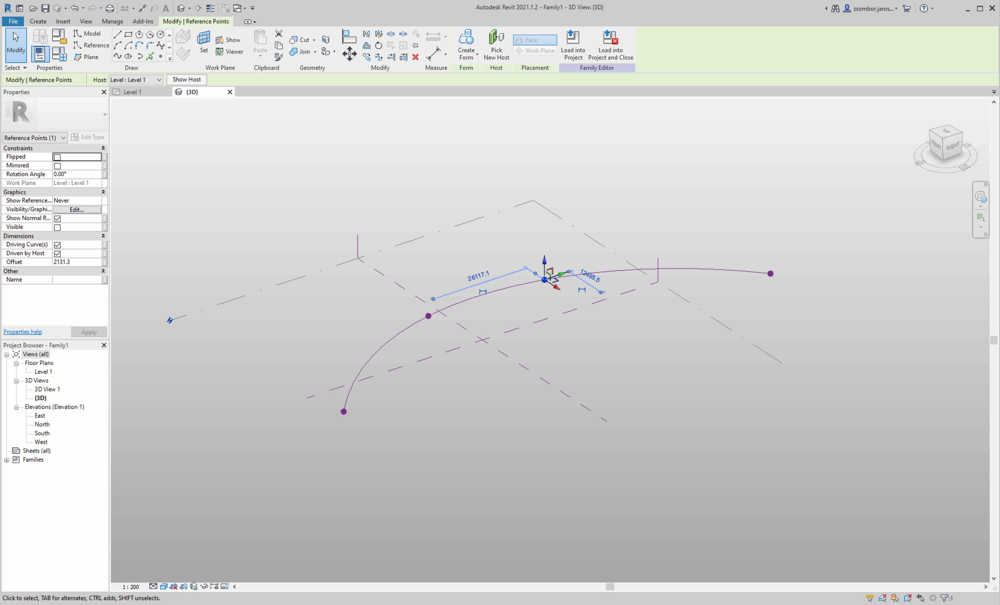

Creating a Tunnel Family
========================

In the following tutorial we'll create a parametric tunnel while covering topics
like nested families, adaptive families, family parameters, dimensions, and 
constrains.

Creating a new project
----------------------

Let's create a new project to host the tunnel family and its child families. 
Have the project based on ***Metric Architectural Template*** or other Metric 
templates. The difference is subtle and mostly changes the UI a bit.

Creating the family for the tunnel
----------------------------------

Let's create a Mass family to hold the tunnel. We'll be using a 
***Conceptual Mass*** to have a family that is not bound to the floor plan 
system of Revit. Masses are usually used for exploring building ideas with
simple shapes.

In the new project, hit ***File/New/Family*** select 
***English/Conceptual Mass/Metric Mass*** and open.

Creating an example tunnel line
-------------------------------

We'll be creating an example tunnel line, a similar one to the 3d tunnel line
that we've generated in Autocad. This will represent the whole tunnel.

  1. Under the ***Create*** tab select the ***Reference Line*** tool. We're 
  gonna create the tunnel line as a reference line, so it doesn't represent 
  geometry.  We'll be able to place the tunnel segments on this line later and 
  also control the tunnel geometry through it.
  
  2. When selecting the ***Reference Line*** tool, the active tab changes on the
  UI to a ***Modify | Place Reference Lines*** one. Usually Revit works in this
  way most of the time. You pick a tool and it gives you a specific 
  ***Modify*** tab that is unique to that given tool.

  3. Pick the ***Spline through points*** in the ***Draw*** ribbon, and draw the
  tunnel line.

  4. And let's move some of the points in 3d so they are not coplanar.

  5. If you're having trouble selecting elements (like points, lines, gizmos) 
  that are overlapping, you can use the tab key to cycle through them. At the 
  bottom left corner Revit states what is the current element in the cycle. By clicking, you can include the desired element in the selection. 

  6. We should have something like this:
  

  7. asdasd

