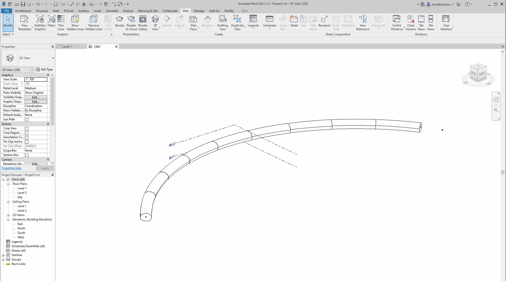

Creating a tunnel family
========================

In the following tutorial we'll create a parametric tunnel while covering topics
like nested families, adaptive families, family parameters, dimensions, and 
constrains.

Creating a new project
----------------------

Let's create a new project to host the tunnel family and its child families. 
Have the project based on ***Metric Architectural Template*** or other Metric 
templates. The difference is subtle and mostly changes the UI a bit.

Creating the family for the tunnel
----------------------------------

Let's create a Mass family to hold the tunnel. We'll be using a 
***Conceptual Mass*** to have a family that is not bound to the floor plan 
system of Revit. Masses are usually used for exploring building ideas with
simple shapes.

In the new project, hit ***File/New/Family*** select 
***English/Conceptual Mass/Metric Mass*** and open.

Creating an example tunnel line
-------------------------------

We'll be creating an example tunnel line, a similar one to the 3d tunnel line
that we've generated in Autocad. This will represent the whole tunnel.

  1. Under the ***Create*** tab select the ***Reference Line*** tool. We're 
  gonna create the tunnel line as a reference line, so it doesn't represent 
  geometry.  We'll be able to place the tunnel segments on this line later and 
  also control the tunnel geometry through it.
  
  2. When selecting the ***Reference Line*** tool, the active tab changes on the
  UI to a ***Modify | Place Reference Lines*** one. Usually Revit works in this
  way most of the time. You pick a tool and it gives you a specific 
  ***Modify*** tab that is unique to that given tool.

  3. Pick the ***Spline through points*** in the ***Draw*** ribbon, and draw the
  tunnel line.

  4. And let's move some of the points in 3d so they are not coplanar.

  5. If you're having trouble selecting elements (like points, lines, gizmos) 
  that are overlapping, you can use the tab key to cycle through them. At the 
  bottom left corner Revit states what is the current element in the cycle. By 
  clicking, you can include the desired element in the selection. 

  6. We should have something like this:
  

Creating the family for the tunnel section
------------------------------------------

Now, we're going to create an adaptive family that will sit on this 3d tunnel 
line and generate a loft like shape based on the curvature of the 3d tunnel line.

  1. Hit ***File/New/Family*** and select 
  ***English/Metric Generic Model Adaptive*** and open.

  2. Adaptive families are flexible families that can be controlled from outside
  by their adaptive points. So for example if you have 3 adaptive points and 
  have a triangle shape defined by them, you can then use this family in another
  project or family and freely change the positions of these points from outside
  and the triangle will adapt to the new locations of the adaptive points. 

  3. In our case we'll create a loft that is using a spline as path which is 
  based on 3 adaptive points. So from the other families, we'll use this family 
  to create any kind of tunnel sections with variable paths controlled by these 
  3 adaptive points.

  4. Let's create the 3 adaptive points with the ***Point Element*** located in 
  the ***Draw*** ribbon under the ***Create*** tab. You can get out from using a
  tool by hitting enter or esc.

  5. We need to turn these points into adaptive points. As always, selecting an 
  element will bring up the contextual ***Modify*** tab. By selecting the first 
  point, we'll get the ***Modify | Reference Points*** tab which has a ***Make 
  Adaptive*** button. Hitting that will turn the reference point into an 
  adaptive point. Turn the points one by one into adaptive points, but do it in 
  an order, because adaptive points get an index and in this case it's necessary
  to have them in asc or desc order.

  6. Let's create the path for the loft. Connect the 3 adaptive points with the 
  ***Reference Line*** tool and use the ***Create/Draw/Spline Through Points*** 
  draw tool.

  7. We should get something like this:
  

Creating the family for the tunnel profile
------------------------------------------

  1. Click ***File/New/Family*** and open ***Generic Model*** (not the adaptive 
  one). Sadly the profile family templates provided by Revit cannot be nested 
  into an adaptive family, so we can't use them in this case.

  2. Let's draw a few ***Reference Plane***-s by clicking the 
  ***Create/Datum/Reference Plan*** and drawing lines. This will give a base for
  the profile. Something like this:
  

  3. Now, we can draw the profile by creating ***Model Line***-s. Click 
  ***Create/Model/Model Line*** and select the ***Spline*** tool.

  4. For some reason it's not possible to create a closed loop with the 
  ***Spline*** tool, so we need to create 2 splines forming a closed loop.

  5. Create the bottom half's spline by clicking the following intersections in 
  order:
  

  6. Create the top half's spline by clicking the following intersections in 
  order:
  

  7. This way we got a profile that's similar that we had in Autocad drawings.

  8. Just to be sure, let's select one of the splines and toggle on both of the 
  ***Join Tangency***-s by locking the little locks which appear at the end of 
  the line when the line gets selected.

  9. In the properties window at the left side of the screen and under the 
  ***Others*** category, we need to set ***Work Plain-Based*** and ***Shared*** 
  to true and the rest to false.

  10. To finish it up, we need to click the ***Load into Project and Close*** 
  button which can be found in the end of all the tabs.

  11. In the pop-up window, select the ***Family2*** family, that should be the 
  tunnel section family. This will close this family and lead us back to the 
  tunnel section family.

  12. In the ***Project Browser*** window at the left bottom corner, we can 
  rename the profile family. It's listed under ***Families/Generic Models***.

Generating the tunnel section geometry
--------------------------------------

  1. Let's place instances of the profile family we've created. Revit's object 
  placement is ***Work Plane*** based, meaning that we have an active work plane
  at all times and that's driving the placement of new objects. So to place a 
  profile instance at the start of the tunnel section line, we need to set the 
  current work plane first.

  2. Click the ***Create/Work Plane/Set*** button and select the following plane
  (use the tab key to cycle through the overlapping planes):
  

  3. You can turn on the visibility of the current work plane by clicking on the
  ***Create/Work Plane/Show*** button.

  4. Place the profile by clicking ***Create/Model/Component*** and selecting 
  the tunnel profile family at the left side in the Properties panel (probably 
  already selected). We need to change the placement mode in the new contextual 
  tab so we can place it on the work plane. Click the 
  ***Modify | Place Component/Placement/Place on Work Plane*** button.

  5. Now, place the profile on the first adaptive point. You can exit the 
  placement tool by hitting esc a few times.

  6. Set the work plane similarly to the 3rd adaptive points plane and place the
  profile there as well.

  7. Now, select the two profiles and the path by holding down control to do a 
  group selection.

  8. And click the ***Modify | Multi select/Form/Create Form/Solid Form*** 
  button to create a loft.

  9. We should have something like this by now:
  

  10. To finish the family up, we should check the ***Shared*** checkbox at the 
  left side in the ***Properties/Other*** section. This will make the family's 
  parts selectable from the outside. This is optional.

  11. Click ***Load into Project and Close*** at the end of any of the tabs and 
  select the ***Family1*** (this should be the tunnel family) to load into. 

  12. Let's rename the family which contains the tunnel section in the 
  ***Project Browser/Generic Models*** and the family is probably called 
  ***Family2***.

Creating the tunnel from tunnel sections
----------------------------------------

  1. To populate the tunnel line with tunnel sections, will divide the path into
  smaller segments and repeat the tunnel section based on them.

  2. To divide the tunnel line, we need to select it and then click the 
  ***Modify | Reference Lines/Divide/Divide Path*** button. This will create a 
  divided path on the reference line.

  3. By default it creates 6 points along the path, but we can crank it up in 
  the ***Properties*** window either to a higher number, or a fixed distance.

  4. The blue dots are the new points created by the divided path, and the 
  purple dots are the original spline control points.
  

  5. Let's place one tunnel section at the start of the path by clicking the 
  ***Create/Model/Component*** button and selecting the tunnel section family in
  the ***Properties*** window (probably already selected).

  6. Now we need to place the 3 adaptive points of the tunnel section family on 
  the first 3 blue points of the divided path.

  7. Make sure to use the tab key to cycle through overlapping elements and 
  check the bottom left corner to see if the current element is indeed a point 
  of the divided path and not something else.

  8. It's enough to place only one tunnel section, because we're gonna repeat it
  automatically along the path. Exit the placement tool by hitting the esc key.

  9. To repeat the tunnel section, select the whole tunnel section 
  (generic model) and click the ***Modify | Generic Models/Modify/Repeate*** 
  icon.

  10. This will make the rest of the tunnel sections along the path. It should 
  look something like this:
  

  11. There's a known issue currently with a slight deviation in rotation in the
  profiles of the neighbouring tunnel sections.

  12. Now we have a tunnel that can be controlled by the 3d tunnel line, has a 
  parametric way of defining the given sections. With a small addition later we 
  can change the profile easily, and each section can be examined individually.

  13. Now if we hit the ***Load into Project and Close*** we can load it and 
  place it in our project. 

Placing the tunnel in the project
---------------------------------

  1. Just place it somewhere, don't worry about its weird look, it's because of 
  the floor based view that Revit by default has. If Revit doesn't give you the 
  placement tool automatically, you can get it by clicking the 
  ***Create/Model/Component*** button and select the tunnel family in the
  ***Properties*** window.

  2. We can change the view by clicking the ***View/3d View*** button.

  3. We should have something like this:
  

  4. Save the project, and save the tunnel family too just to be sure.

Exposing parameters - Tunnel Section Length
-------------------------------------------

  1. To make the tunnel a bit more parametric, we can create and expose 
  parameters that control the profile, the size of the profile and the number of
  segments (or length). The tunnel path is already easily editable within the 
  tunnel family.

  2. Let's open the tunnel family by double clicking the tunnel.

  3. This will open up the tunnel family with a weird 3d view, so click 
  ***View/Default 3d View*** to get a better one.

  4. To expose the tunnel section's length, we need to click the divided path 
  and in the ***Properties*** window change the layout to fixed distance (this 
  will change it so we're defining a distance instead a number of segments) and 
  to expose the ***Distance*** parameter we need to click the small grey button 
  right to the parameter's field box.

  5. This will bring up an ***Associate Family Parameter*** window where we can 
  associate parameters of elements (like this divided path, or for example a 
  dimension) with the family's parameters. So we'll be able to control these 
  parameters in one place through the family's parameters and even from outside 
  of the family.

  6. Let's create a new parameter by clicking the ***New Parameter*** icon, name
  it ***TunnelSectionLength*** for example, and set it to 
  ***Instance Parameter***.

  7. Click OK in both windows. Now, if we look at the family's parameters by 
  clicking the ***Modify/Properties/Family Types*** button, we get a list of 
  parameters (variables) of the family.

  8. Here we can change the ***TunnelSectionLength*** parameter we've created 
  and by hitting the ***Apply*** button Revit will update the tunnel with the 
  new value.

Exposing parameters - Tunnel Profile
------------------------------------

  1. Open the tunnel section family by double clicking on one section. (Use the 
  tab key to cycle through overlapping elements)

  2. First, we'll create a new family parameter that can store 
  ***Generic Model*** references.

  3. We need to click the ***Create/Properties/Family Types*** button and there 
  click the ***New Parameter*** icon.

  4. The ***Type of parameter*** has to be ***\<Family Type...\>*** and from the
  ***Select Category*** list we need the ***Generic Models*** category.

  5. Set the parameter to Instance type, and name it ***Profile*** or something
  like that.

  6. Click OK on both windows.

  7. Now, let's select the two profiles of the tunnel section (use CTRL to do 
  multi select).

  8. In the ***Properties*** window, and under the ***Other*** section we need 
  to change the ***Label*** property from ***None*** to the newly created 
  ***Profile*** family parameter to associate it with the family parameter.

  9. From now on the ***Profile*** family parameter drives the tunnel section's 
  profile.

  10. Nothing visible has changed, because by default the ***Profile*** family 
  parameter got the existing ***TunnelProfile*** family as the value.

  11. Let's create a new profile family based on the ***Metric Generic Model*** 
  template.

  12. For testing, just create a simple rectangular ***Model Line*** found under
  ***Create/Model/Model Line***. And don't forget to have the 
  ***Work Plane-Based*** and ***Shared*** checked and the rest unchecked in the 
  ***Properties*** window.

  13. Remember this family's name (the header of Revit displays it) and click 
  ***Load into Project and Close*** and load it into the tunnel section family 
  and also into the tunnel family (we'll need it later to change the profile 
  from the tunnel family).

  14. In the tunnel section family, exit the placement tool by hitting a few esc
  keys.

  15. Now, if we open up the ***Modify/Properties/Family Types*** we can set the
  Profile's value to this new profile family.

  16. And it should look like this:
  

  17. Let's load the tunnel section family into the tunnel family to get it 
  updated. Click the ***Modify/Family Editor/Load into Project*** and if there's
  a ***Family Already Exists*** pop-up then select 
  ***Overwrite the existing version*** to get it updated.

  18. Now, we can change the profile from outside by selecting one section and 
  changing the ***Profile*** parameter in the ***Properties*** window.
  

Exposing parameters - Profile Size
----------------------------------

  1. The following section will demonstrate how to create parametric profiles
  with parameter driven dimensions and constraints.

  2. Let's open the rectangular profile family by clicking the profile in the 
  tunnel section family twice.

  3. This will open up the profile family, however the the view that Revit gives
  by default is empty. We need to open a top-down like view by clicking the 
  Floor Plans/Ref. Level in the Project Browser window at the left side of the 
  screen.

  4. In Revit, we usually dimension and constrain reference planes and attach
  model and geometry lines to these reference planes.

  5. Let's modify the rectangular profile by adding a few reference planes to 
  have something like this:
  

  6. Now, we need to attach/lock the existing model lines to the reference 
  planes. We can do that with the ***Align*** tool.

  7. Let's click the ***Modify/Modify/Align*** button, and first select one of 
  the reference planes and then the model line we want to attach to the plane.

  8. Having model lines aligned to the given reference plane doesn't mean that 
  the model line is attached/lock to that reference plane. When we're using the 
  align tool, a lock will appear next to the model line that we need to lock to 
  attach the model line to the reference plane. This locking is the whole 
  purpose of using the align tool in this case.
  

  9. Lock all model lines to the given reference plane. You can test it by 
  moving the reference planes around.

  10. After we've attached all four model lines to the reference planes, we can 
  create the parametric dimensions and constraints to control the profile's 
  size.

  11. First let's create an equality dimension/constraint to have the profile 
  centred at all times.

  12. Click the ***Modify/Measure/bottom button's carrot*** and select the 
  ***Aligned Dimension*** tool.

  13. Pick the three vertical reference planes in order and then click anywhere 
  else into the void to finish the 2 part dimension.

  14. To apply the equality constrain between these two dimension segments, 
  click the EQ label. (If you didn't get the EQ label, then try again creating 
  the two part dimension and make sure to create them at the same time without 
  escaping the dimension tool)

  15. Now, let's add another ***Aligned Dimension*** to control the size 
  horizontally. Create the dimension between the left and right vertical 
  reference planes. (You don't need to lock this dimension)

  16. To control this dimension with a Family Parameter, we need to select the 
  dimension and click the 
  ***Modify | Dimension/Label Dimension/Create Parameter*** button.

  17. Name it ***Size*** set it to Instance and click OK.

  18. Now, if we open up the ***Modify/Properties/Family Types*** then we can 
  test resizing the profile.

  19. Change the ***Size*** parameter and hit ***Apply***, this should update 
  the profile and we should have something like this:
  

  20. Now, let's load this profile family into the tunnel section family. After 
  clicking the ***Load into Project and Close***, select the 
  ***Overwrite the existing*** version option to update the family.

  21. Selecting one of the profiles of the loft, we should be able to edit the 
  profile family's ***Size*** parameter in the ***Properties*** window and under
  the ***Dimensions*** section.

  22. Additionally, we can associate this ***Size*** parameter with a parameter 
  of this family (tunnel setion) so it gets exposed to one level above into the 
  tunnel family.

  23. We can do this by clicking the small grey button next to the ***Size*** 
  parameter in the ***Properties*** window and do the same thing we did with the
  Tunnel Section Length parameter.
  

  24. We can create the profile families in a way that all of them make use of 
  the same parameters like this ***Size*** so it won't matter which exact 
  profile is in use, we'll still be able to control their sizes, or any other 
  aspect of the profiles we create.

